# Receipt Slayer - Technical Documentation

**Version:** 1.0 (MVP)
**Date:** 2026-02-28
**Project:** AI-Enabled Expense Intelligence Engine (Hackathon MVP)

---

## Table of Contents

1. [System Overview](#1-system-overview)
2. [High-Level Architecture](#2-high-level-architecture)
3. [Technology Stack](#3-technology-stack)
4. [Application Flow — End to End](#4-application-flow--end-to-end)
5. [Screen-by-Screen Flow](#5-screen-by-screen-flow)
   - 5.1 [Upload Screen](#51-upload-screen)
   - 5.2 [Review & Categorize Screen](#52-review--categorize-screen)
   - 5.3 [Report Screen](#53-report-screen)
   - 5.4 [Chat Insights Panel](#54-chat-insights-panel)
6. [API Endpoint Reference](#6-api-endpoint-reference)
7. [Data Models](#7-data-models)
8. [Extraction Pipeline](#8-extraction-pipeline)
9. [Category Engine](#9-category-engine)
10. [Chat Insights Engine](#10-chat-insights-engine)
11. [Report Builder & Export](#11-report-builder--export)
12. [Frontend-Backend Communication](#12-frontend-backend-communication)
13. [Error Handling Strategy](#13-error-handling-strategy)
14. [Environment & Configuration](#14-environment--configuration)
15. [File Structure](#15-file-structure)

---

## 1. System Overview

Receipt Slayer converts receipt images into structured expenses, auto-suggests categories using AI, and generates submission-ready reports with natural-language chat insights. It is designed as a single-user MVP with in-memory storage, no authentication, and a stateless API.

**Core Capabilities:**
- Receipt image upload with AI-powered field extraction (Claude Vision)
- Pre-built sample receipts for reliable demo mode
- Rule-based + AI-assisted category suggestion (with user-defined custom categories)
- Editable review screen with confidence scoring
- Expense report with totals by category
- CSV export
- Chat-based insights panel powered by deterministic aggregates + Claude NL phrasing

---

## 2. High-Level Architecture

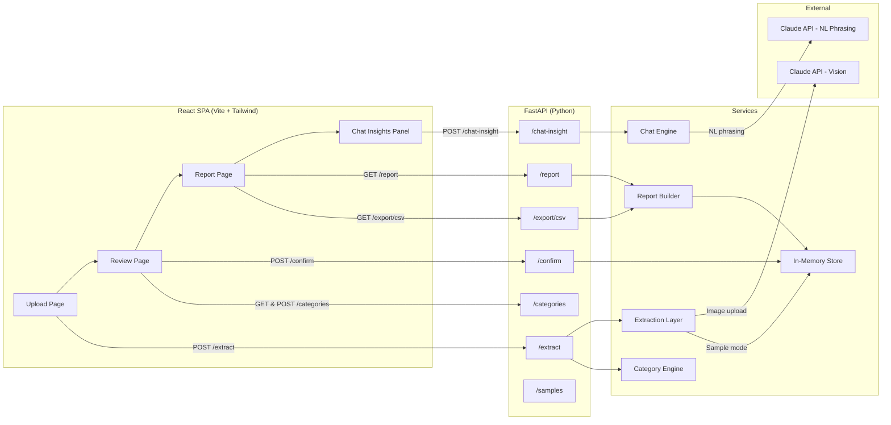

### Request Flow Summary

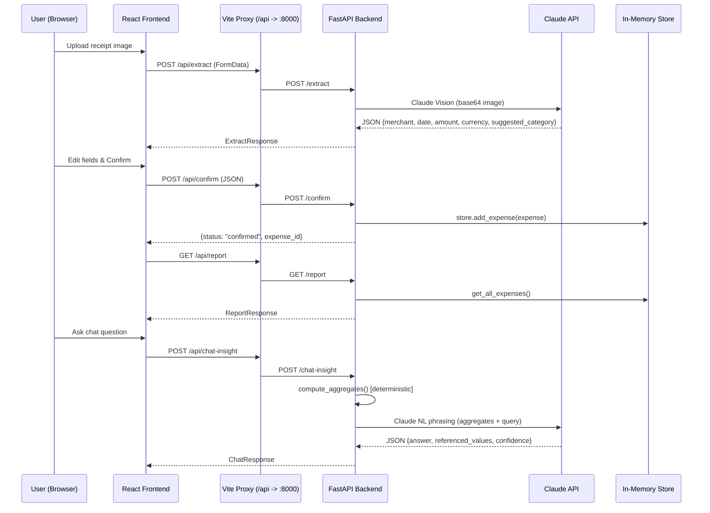

---

## 3. Technology Stack

| Layer          | Technology                        | Purpose                              |
|----------------|-----------------------------------|--------------------------------------|
| Frontend       | React 19 + TypeScript             | Single Page Application              |
| Styling        | Tailwind CSS v4                   | Utility-first CSS framework          |
| Bundler        | Vite 7                            | Dev server + HMR + API proxy         |
| Routing        | React Router DOM v7               | Client-side routing                  |
| Icons          | Lucide React                      | UI iconography                       |
| File Upload    | react-dropzone                    | Drag-and-drop file upload            |
| Backend        | FastAPI (Python)                  | REST API server                      |
| Server         | Uvicorn                           | ASGI server with hot reload          |
| LLM            | Claude API (Anthropic SDK)        | Vision extraction + NL phrasing      |
| Validation     | Pydantic v2                       | Request/response data models         |
| Storage        | Python in-memory (list)           | Expense storage (no DB for MVP)      |
| Export         | Python csv module                 | CSV report generation                |

---

## 4. Application Flow — End to End

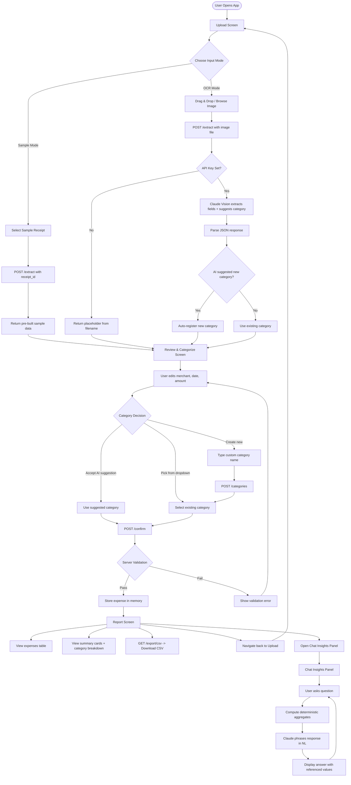

---

## 5. Screen-by-Screen Flow

### 5.1 Upload Screen

**Route:** `/` | **Component:** `UploadPage.tsx`

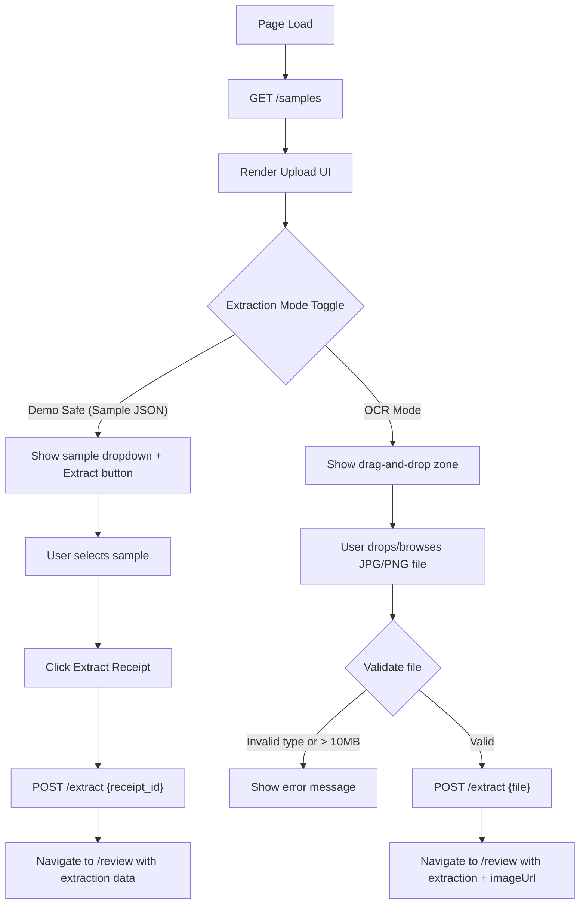

**Key Details:**
- Samples are fetched from `GET /samples` on mount (5 pre-built receipts)
- Mode toggle switches between sample JSON mode and OCR upload mode
- File validation: JPG/PNG only, max 10MB (client-side + server-side)
- On successful extraction, navigates to `/review` via React Router state

---

### 5.2 Review & Categorize Screen

**Route:** `/review` | **Component:** `ReviewPage.tsx`

```mermaid
flowchart TD
    LOAD[Page Load] --> CHECK_STATE{Extraction data in router state?}
    CHECK_STATE -->|No| EMPTY[Show "No extraction data" + link to Upload]
    CHECK_STATE -->|Yes| FETCH_CATS[GET /categories]

    FETCH_CATS --> CHECK_AI_CAT{AI suggested category in list?}
    CHECK_AI_CAT -->|No| ADD_LOCAL[Add AI category to local dropdown]
    CHECK_AI_CAT -->|Yes| RENDER[Render form with pre-filled fields]
    ADD_LOCAL --> RENDER

    RENDER --> POPUP[Show Category Suggestion Popup]
    POPUP --> POPUP_CHOICE{User choice}
    POPUP_CHOICE -->|Accept| SET_CAT[Set category to AI suggestion]
    POPUP_CHOICE -->|Change| CLOSE_POPUP[Close popup, user picks manually]

    RENDER --> EDIT[User edits fields]
    EDIT --> CATEGORY{Category action}
    CATEGORY -->|Select existing| USE_EXISTING[Pick from dropdown]
    CATEGORY -->|"Click + New"| SHOW_INPUT[Show new category input]
    SHOW_INPUT --> TYPE_NAME[User types category name]
    TYPE_NAME --> SAVE_CAT["POST /categories {name}"]
    SAVE_CAT --> UPDATE_DROPDOWN[Update dropdown + select new category]
    UPDATE_DROPDOWN --> USE_EXISTING

    USE_EXISTING --> CLICK_CONFIRM[Click Confirm Expense]
    SET_CAT --> CLICK_CONFIRM

    CLICK_CONFIRM --> CLIENT_VALIDATE{Client-side validation}
    CLIENT_VALIDATE -->|Fail| SHOW_ERRORS[Show field errors]
    CLIENT_VALIDATE -->|Pass| POST_CONFIRM["POST /confirm {expense data}"]
    POST_CONFIRM --> SERVER_VALIDATE{Server validation}
    SERVER_VALIDATE -->|Fail| SHOW_SERVER_ERR[Show server error]
    SERVER_VALIDATE -->|Pass| NAV_REPORT["Navigate to /report"]
```

**Validation Rules (Client + Server):**
| Field    | Rule                          | Confidence Indicator        |
|----------|-------------------------------|-----------------------------|
| Merchant | Required, non-empty           | Low = amber border + "Needs review" |
| Date     | Must match `YYYY-MM-DD`       | Low = amber border + "Needs review" |
| Amount   | Numeric, > 0                  | Low = amber border + "Needs review" |
| Category | Required, non-empty           | Shown in suggestion popup   |

**Dynamic Categories Feature:**
- Categories fetched from `GET /categories` on mount (not hardcoded)
- AI can suggest new categories during extraction (shown with "AI New" badge)
- Users can add custom categories via the "+ New" button
- New categories are persisted server-side via `POST /categories`
- The `/confirm` endpoint auto-registers any unknown category

---

### 5.3 Report Screen

**Route:** `/report` | **Component:** `ReportPage.tsx`

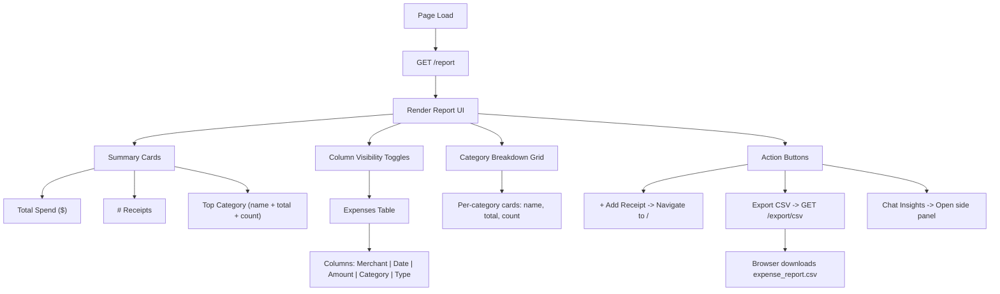

**CSV Export Format:**
```
ID, Merchant, Date, Amount, Currency, Category, Type
a1b2c3d4, Delta Air Lines, 2026-02-15, 487.50, USD, Travel, Business
```

---

### 5.4 Chat Insights Panel

**Location:** Right-side drawer on Report Screen

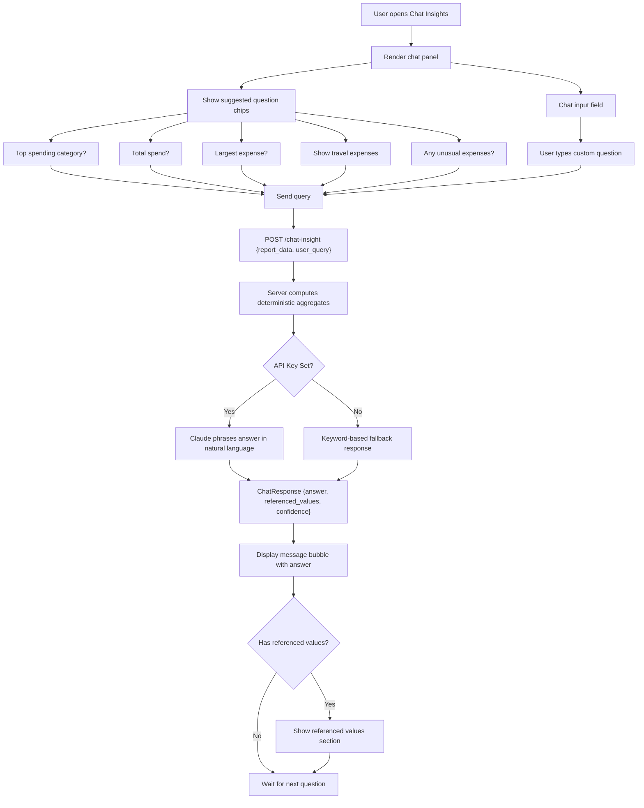

**Chat Engine — Deterministic-First Design:**

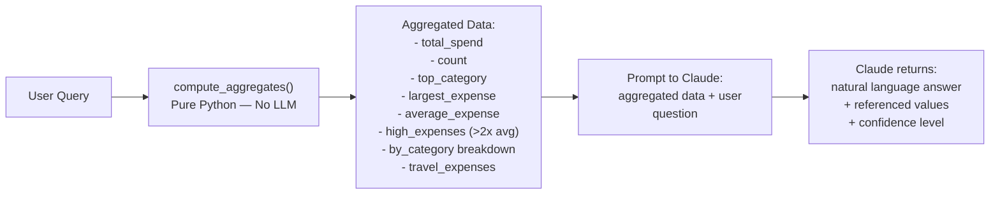

> **Important:** Claude never computes numbers. All aggregates are deterministic Python. Claude only phrases the pre-computed data into natural language.

---

## 6. API Endpoint Reference

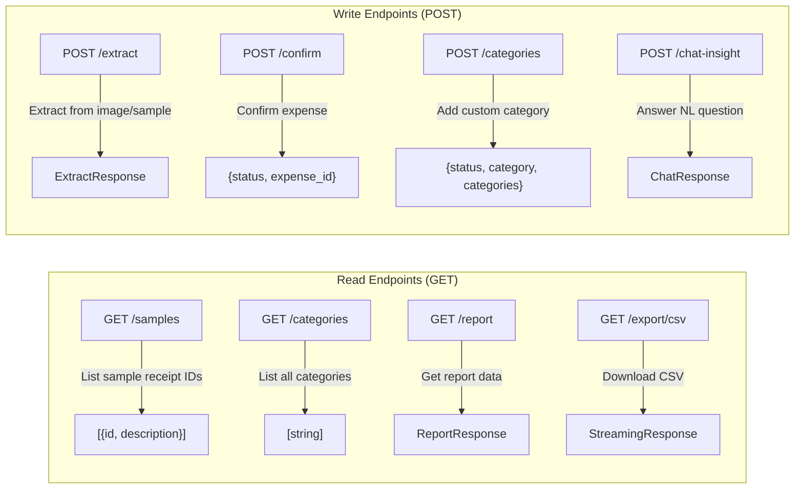

| Method | Path              | Input                            | Output                       | Notes                                    |
|--------|-------------------|----------------------------------|------------------------------|------------------------------------------|
| GET    | `/samples`        | —                                | `[{id, description}]`       | Lists 5 pre-built sample receipts        |
| GET    | `/categories`     | —                                | `[string]`                   | Default + user/AI-added categories       |
| POST   | `/categories`     | `{name: string}`                 | `{status, category, categories}` | Idempotent; returns "exists" if duplicate |
| POST   | `/extract`        | `FormData: file OR receipt_id`   | `ExtractResponse`            | Claude Vision for images; sample lookup for IDs |
| POST   | `/confirm`        | `ConfirmRequest` (JSON)          | `{status, expense_id}`       | Validates + stores; auto-registers new categories |
| GET    | `/report`         | —                                | `ReportResponse`             | Computes totals_by_category from store   |
| GET    | `/export/csv`     | —                                | CSV file download            | Content-Disposition: attachment           |
| POST   | `/chat-insight`   | `{report_data, user_query}`      | `ChatResponse`               | Stateless; client sends full report data |

---

## 7. Data Models

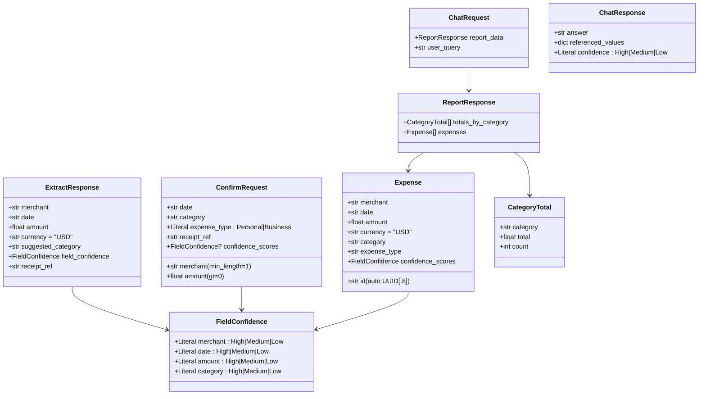

---

## 8. Extraction Pipeline

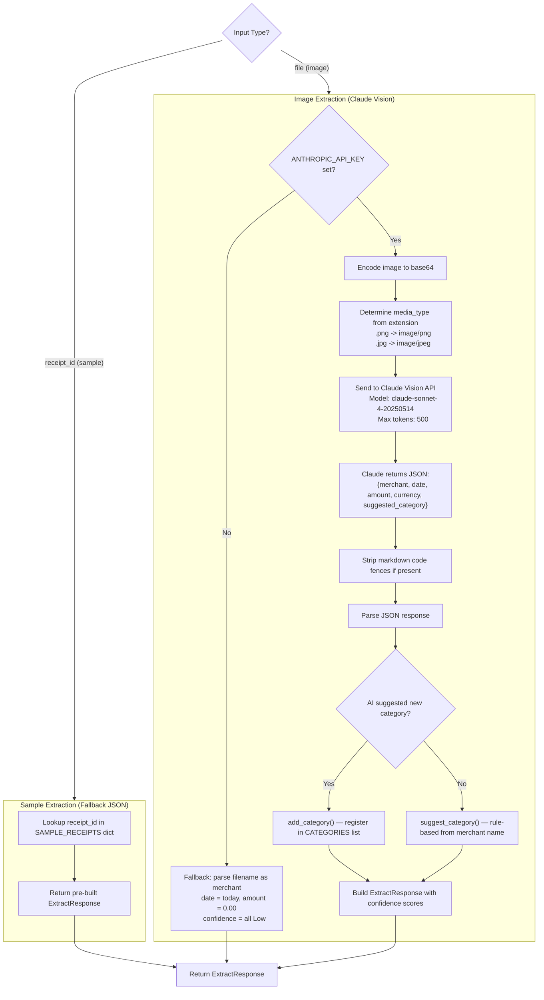

**Sample Receipts (5 pre-built):**

| ID          | Merchant            | Amount   | Category              |
|-------------|---------------------|----------|-----------------------|
| sample-001  | Delta Air Lines     | $487.50  | Travel                |
| sample-002  | The Capital Grille  | $156.32  | Meals & Entertainment |
| sample-003  | Staples             | $89.97   | Office Supplies       |
| sample-004  | Marriott Downtown   | $312.00  | Accommodation         |
| sample-005  | Uber                | $34.75   | Transportation        |

---

## 9. Category Engine

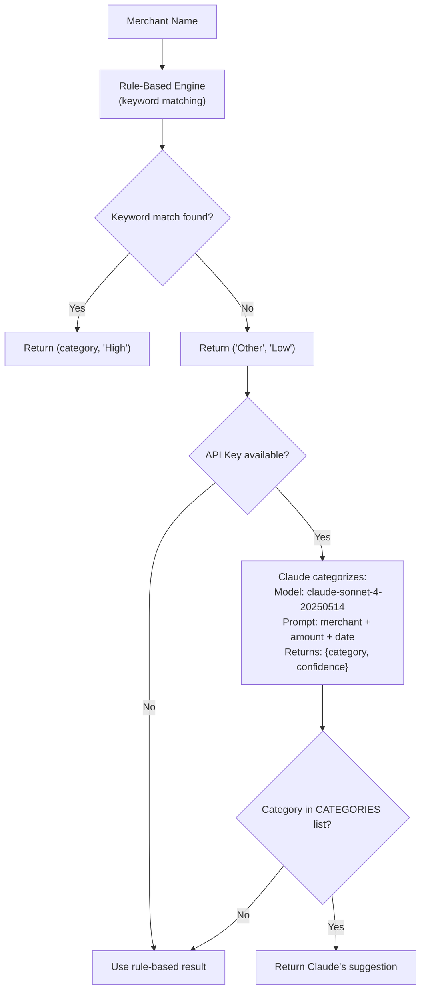

**Keyword Map (Rule-Based):**

| Category              | Keywords                                                     |
|-----------------------|--------------------------------------------------------------|
| Travel                | airline, flight, delta, united, southwest, jetblue, etc.     |
| Meals & Entertainment | restaurant, cafe, bar, starbucks, mcdonald, chipotle, etc.  |
| Office Supplies       | staples, office depot, paper, ink, toner, etc.               |
| Transportation        | uber, lyft, taxi, parking, gas, shell, chevron, etc.         |
| Accommodation         | marriott, hilton, hotel, airbnb, hyatt, holiday inn, etc.    |
| Equipment             | apple, dell, laptop, best buy, amazon, newegg, etc.          |

**Dynamic Category Management:**

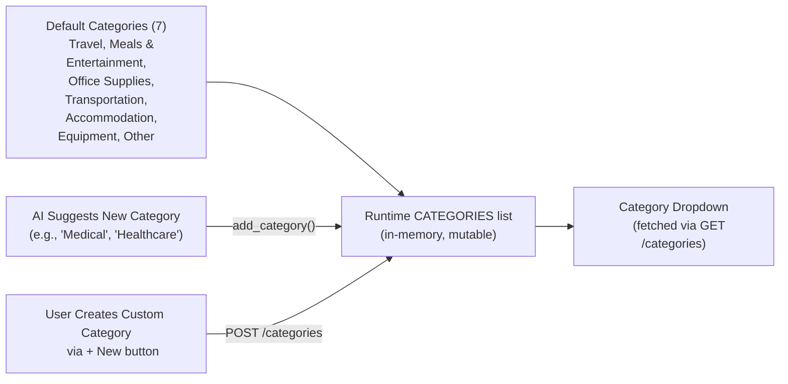

---

## 10. Chat Insights Engine

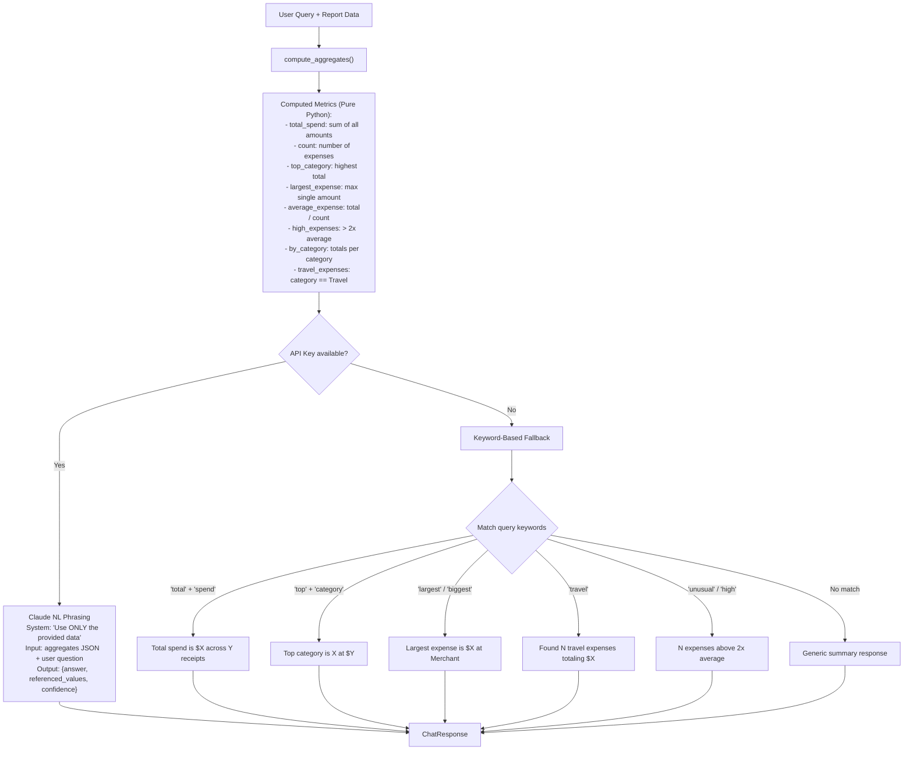

---

## 11. Report Builder & Export

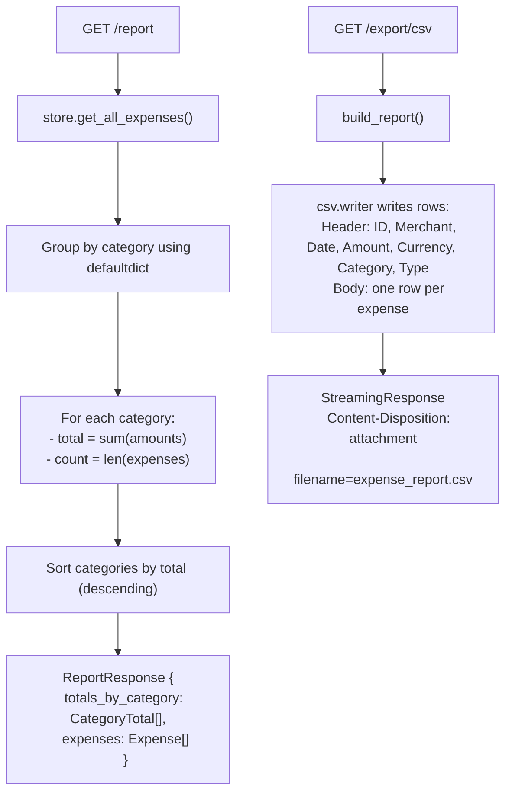

---

## 12. Frontend-Backend Communication

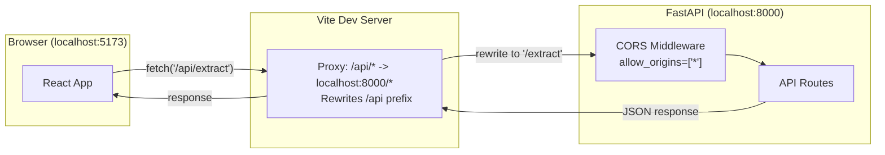

**Vite Proxy Configuration** (`vite.config.ts`):
```typescript
server: {
  proxy: {
    '/api': {
      target: 'http://localhost:8000',
      changeOrigin: true,
      rewrite: (path) => path.replace(/^\/api/, ''),
    },
  },
}
```

All frontend API calls use the `/api` prefix, which Vite proxies to the FastAPI backend on port 8000 with the prefix stripped.

---

## 13. Error Handling Strategy

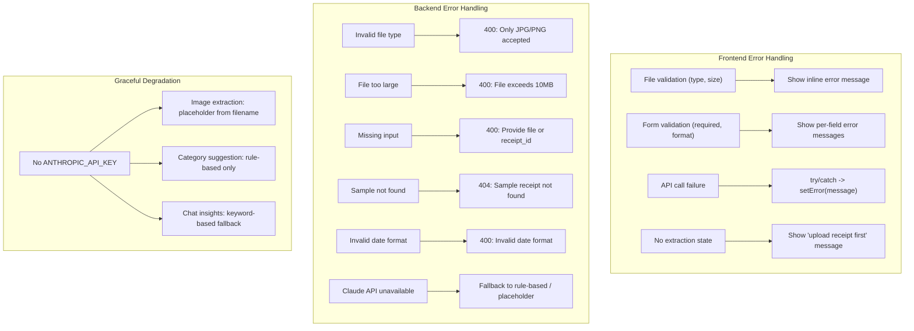

---

## 14. Environment & Configuration

| Variable          | Required | Default | Description                                      |
|-------------------|----------|---------|--------------------------------------------------|
| `ANTHROPIC_API_KEY` | No*    | —       | Claude API key. *Required for AI features.       |
| `FALLBACK_MODE`   | No       | —       | Toggle fallback JSON extraction (for demo)       |
| `TESSERACT_PATH`  | No       | —       | Path to Tesseract binary (not used in MVP)       |

**Ports:**
- Frontend (Vite): `http://localhost:5173`
- Backend (Uvicorn): `http://localhost:8000`

**Startup Commands:**
```bash
# Backend
cd backend && source venv/Scripts/activate && uvicorn main:app --reload --port 8000

# Frontend
cd frontend && npm run dev
```

---

## 15. File Structure

```
receipt-slayer/
├── CLAUDE.md                          # AI assistant instructions
├── docs/
│   ├── problem-statement.txt          # BRD + FRD + TRD
│   ├── Receipt_Slayer_BRD.docx        # Business Requirements Document
│   └── technical-documentation.md     # This document
├── backend/
│   ├── .env                           # Environment variables (ANTHROPIC_API_KEY)
│   ├── requirements.txt               # Python dependencies
│   ├── venv/                          # Python virtual environment
│   ├── main.py                        # FastAPI app + route handlers
│   ├── models.py                      # Pydantic models + CATEGORIES list
│   ├── extraction.py                  # Receipt extraction (Claude Vision + fallback)
│   ├── category_engine.py             # Rule-based + Claude category suggestion
│   ├── chat_engine.py                 # Deterministic aggregates + Claude NL phrasing
│   ├── report_builder.py              # Report aggregation from in-memory store
│   ├── sample_data.py                 # 5 pre-built sample receipts
│   └── store.py                       # In-memory expense storage
└── frontend/
    ├── package.json                   # Node dependencies
    ├── vite.config.ts                 # Vite config + API proxy
    ├── tsconfig.json                  # TypeScript configuration
    └── src/
        ├── main.tsx                   # React entry point
        ├── App.tsx                    # Router + layout (header + nav)
        ├── index.css                  # Tailwind imports + custom theme
        ├── api.ts                     # API client functions
        ├── types.ts                   # TypeScript interfaces + CATEGORIES
        └── pages/
            ├── UploadPage.tsx         # Screen 1: Upload receipt
            ├── ReviewPage.tsx         # Screen 2: Review & categorize
            └── ReportPage.tsx         # Screen 3: Report + Chat panel
```

---

*End of Technical Documentation*
